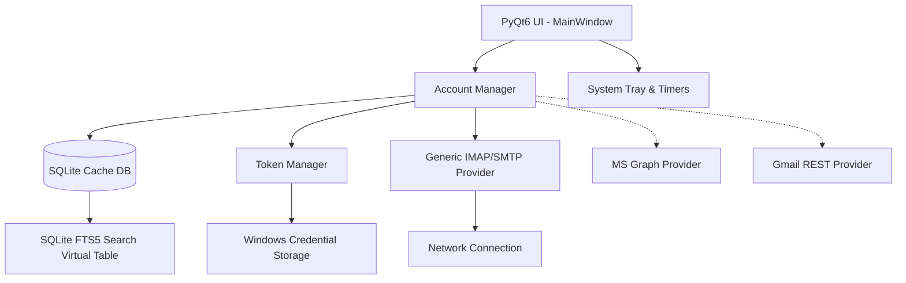

# Vantage Mail

[](https://www.python.org/)
[](https://www.riverbankcomputing.com/software/pyqt/)
[](LICENSE)
[]()

Vantage Mail is a basic desktop email client built using **Python 3.13** and **PyQt6**. This initial version provides a robust foundation—featuring a three-pane layout, local offline caching, and fast SQLite FTS5 search speeds—laying the groundwork to evolve into a full-featured productivity suite.

---

## 🌟 Key Features

* **Universal Account Support**: IMAP/SMTP (Hostinger, Yahoo, iCloud, Zoho, Fastmail, ProtonMail, Generic cPanel) along with pre-designed hooks for Google Gmail API and Microsoft Graph API (Google and Microsoft enablement coming soon).
* **Smart Account Wizard**: Automatically detects server settings (IMAP/SMTP hosts and ports) based on the user's email domain.
* **SQLite Offline Cache & Sync**: Downloads and merges mailbox structure and messages locally. Caches are loaded progressively to keep the UI immediate.
* **Collapsible Grouped FTS5 Search**: An independent search window allows searching across multiple selected accounts. Results are indexed instantly using SQLite's **FTS5 (Full-Text Search)** virtual table and grouped into "Matches in Subject" and "Matches in Body" collapsible root tree nodes.
* **Auto-Mark-As-Read**: Selecting an unread email automatically marks it read on both the server and local cache after a customizable 3-second delay.
* **Modeless Windowing & System Tray**: Launches email viewers and drafts composers as independent window instances in the OS taskbar. Integrates with the system tray to run background syncs and display new mail alerts.
* **Rich Text Composer**: Features a complete editing toolbar with font selection, size, formatting (bold, italic, underline, strike), color dialog, alignment, lists, and signature insertion templates.
* **Native Attachments Handling**: View attachments inside the reading pane as buttons, open them using default system applications, or save them locally.
* **Rotating Daily Logs**: Logs exceptions and sync statistics, rolls log files daily, and keeps a maximum of 7 days of logs.

---

## 🏛️ System Architecture



* **Main Thread Safety**: All network handshakes, sync queries, and folder checks are executed in isolated worker threads (`QThread`), keeping the main Qt UI thread completely smooth and responsive.
* **Secure Storage**: Sensitive authentication tokens and passwords are saved directly into the **Windows Credential Manager** via native Win32 APIs (`win32cred`).

---

## 🚀 Getting Started

### 💻 End Users (Standalone Installation)

Vantage Mail is packaged as a standalone application. **No dependencies (including Python) are required to run the installer.**

* **Windows**: Download and run the [vantage-mail-1.0.0-win64.msi](https://github.com/topcatai/VantageMail/releases/download/v1.0.0/vantage-mail-1.0.0-win64.msi) installer.

---

### 🛠️ Developers (Running & Building from Source)

#### Prerequisites

Ensure you have **Python 3.13+** and **Git** installed on your system.

#### Installation & Setup

1. Clone the repository:
   ```bash
   git clone https://github.com/topcatai/VantageMail.git
   cd VantageMail
   ```

2. Setup virtual environment:
   ```bash
   python -m venv venv
   # On Windows:
   venv\Scripts\activate
   # On macOS/Linux:
   source venv/bin/activate
   ```

3. Install dependencies in editable development mode:
   ```bash
   pip install -e .[dev]
   ```

### Running the Application

To launch Vantage Mail:
```bash
python src/main.py
```

### Running Tests

To run the pytest suite:
```bash
pytest tests/ -v
```

---

## 📦 Build & Packaging

Vantage Mail is set up for native desktop package generation across platforms:

### Windows (MSI Installer)
To compile the standalone Windows executable and pack it into a standard MSI installer using `cx_Freeze`:
```bash
python setup_cx.py bdist_msi
```
The installer is generated under `dist/vantage-mail-1.0.0-win64.msi`.

### macOS (.app and DMG)
To build a macOS native app bundle using `py2app` and wrap it into a mountable DMG disk image:
```bash
cd packaging/macos
chmod +x build_dmg.sh
./build_dmg.sh
```

### Linux Packages
Setup packaging specs are located in `packaging/linux/`:
* **Debian/Ubuntu (`.deb`)**:
  ```bash
  cd packaging/linux
  chmod +x build_deb.sh
  ./build_deb.sh
  ```
* **Fedora/RHEL (`.rpm`)**: Building guidelines using `vantage-mail.spec`.
* **Arch Linux (AUR)**: Packaging spec via `PKGBUILD`.

---

## 📄 License

This project is licensed under the MIT License - see the [LICENSE](LICENSE) file for details.
